# Exploratory Data Analysis: Mathematics Genealogy Project

This notebook explores the MGP dataset of 338,526 mathematician records scraped from
the [Mathematics Genealogy Project](https://www.mathgenealogy.org/). The goal is to
understand the structure, coverage, and historical trends in the data before any
modeling work.

All figures below are pulled directly from the notebook's saved outputs — no need to
run the code to see them.

---

## 1. Data Loading and Setup

The raw JSON is flattened into a DataFrame from the `nodes` list. Two derived columns,
`number_of_students` and `number_of_advisors`, are computed from list-field lengths.

Final shape: **338,532 rows × 12 columns**. Subject-code coverage after cleanup:
**202,492 / 338,532** (77,711 rows that were prediction-filled were reverted to empty).

---

## 2. Data Completeness

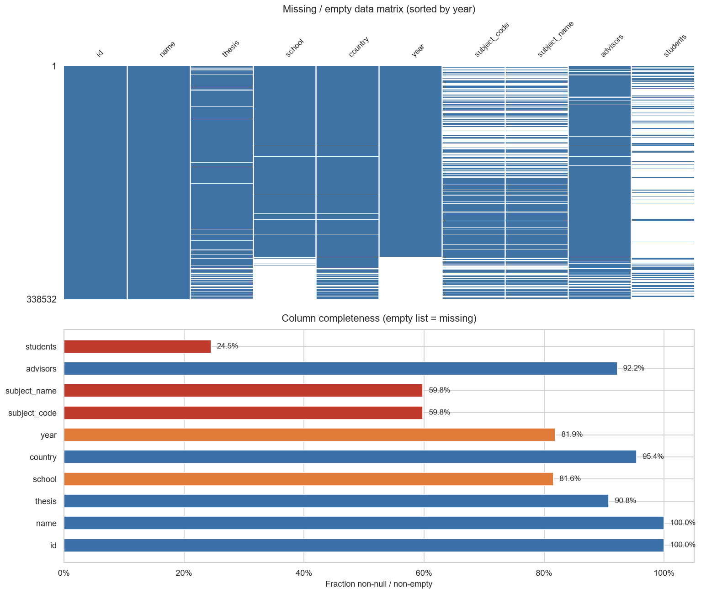

Coverage is strong for `id`, `name`, `country`, and `advisors`/`students`, but weaker for
`year` (81.9%), `school` (83.2%), and especially `subject` (59.8%).

Notes:
- Empty lists `[]` in `advisors`/`students` are treated as missing, not present.
- The missingno matrix is sorted by `year`: missing values cluster in older records —
  earlier mathematicians are less likely to have a recorded school, subject, or thesis title.

---

## 3. Student Count Distribution

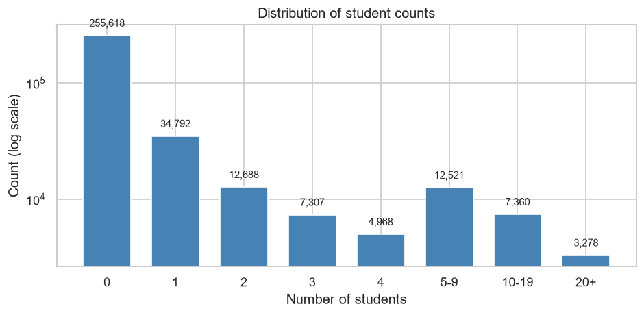

Extremely right-skewed: roughly 75% of mathematicians have no listed students, and only
a small fraction have more than five. Shown on a log scale to make the tail visible.

---

## 4. PhD Output Over Time

### 4.1 All years (1700–2025)
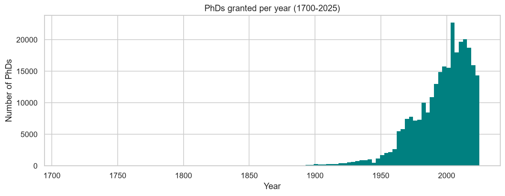

Negligible activity before 1850, a slow rise through the early 20th century, and an
explosive growth phase from the 1950s onward driven by the post-WWII academic expansion.

### 4.2 Modern period (1900–2025)
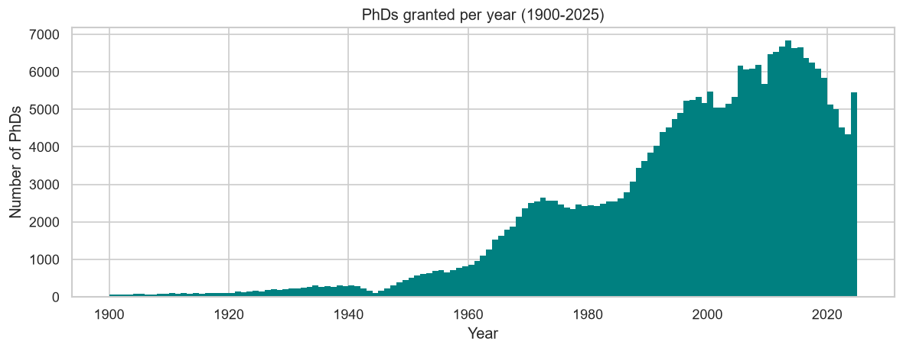

Zooming in to 1900+ with 1-year bins reveals finer structure: the post-Sputnik surge in
the 1960s–70s, and an apparent drop-off after ~2018 that is a **data entry lag artifact**
(recent PhDs take time to be entered into MGP), not a real decline.

---

## 5. Geography

### 5.1 Top countries by record count
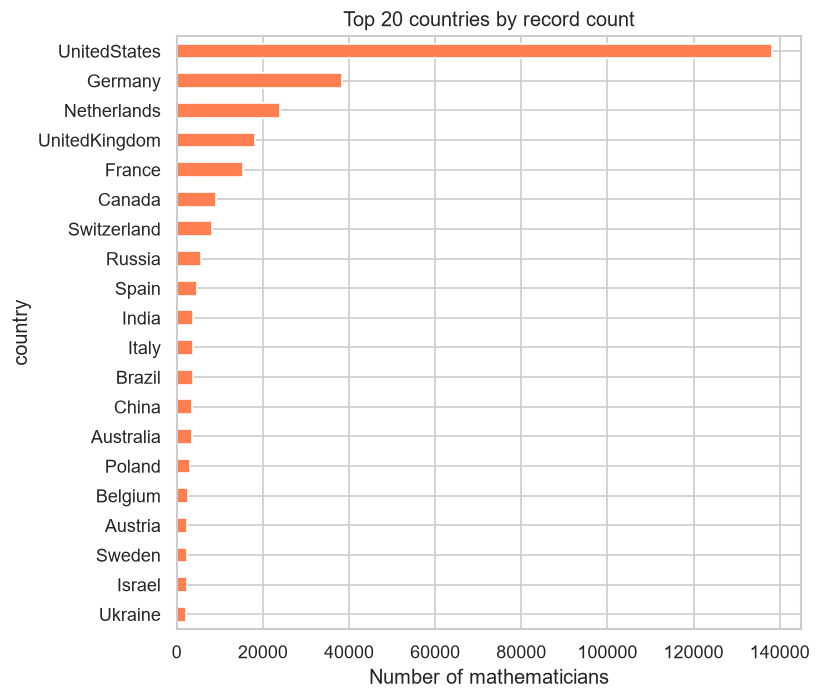

| Country | Records |
|---|---|
| United States | 138,138 |
| Germany | 38,430 |
| Netherlands | 24,055 |
| United Kingdom | 18,269 |
| France | 15,447 |
| Canada | 9,193 |
| Switzerland | 8,096 |
| Russia | 5,681 |

The Netherlands ranking above the UK and France is surprising given population size —
this reflects **MGP coverage depth, not actual PhD output**. The Netherlands' 24,055
records come almost entirely from 15 institutions (Universiteit van Amsterdam alone:
4,840). Germany's 38,430 records are spread across hundreds of institutions (largest,
Göttingen, only 629), suggesting many German records simply aren't in the database.

### 5.2 PhD output over time: top 5 countries
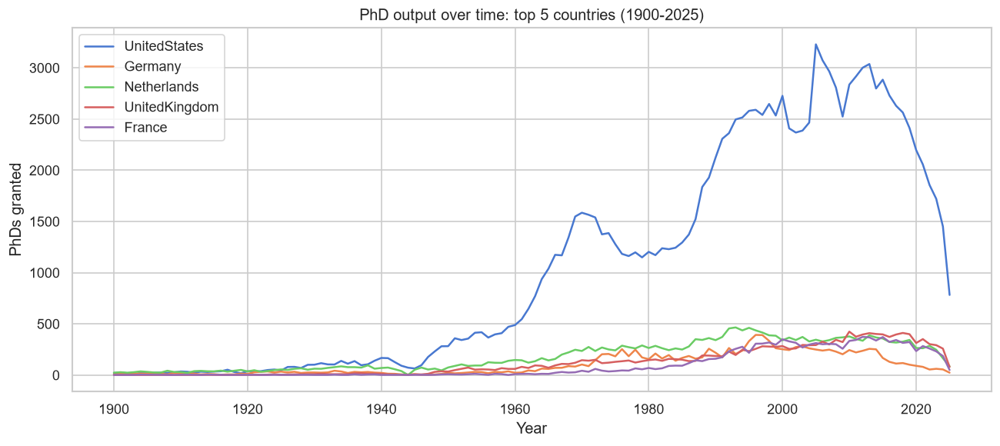

The US rises steeply from the 1950s, peaking around 3,200 PhDs/year near 2005 before
declining. Germany, Netherlands, UK, and France each plateau in the 200–500 range. The
sharp drop after 2020 across all countries is likely the same data-entry lag artifact.

### 5.3 Top countries per century
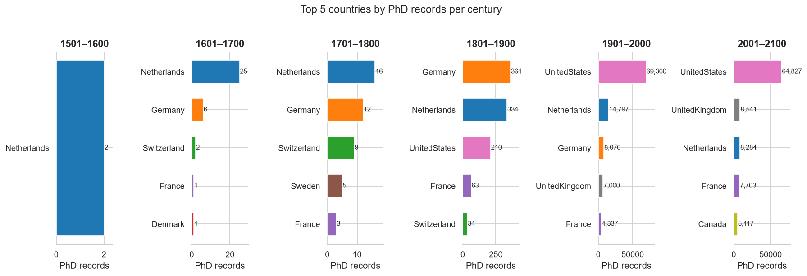

A clear historical shift in where mathematics was institutionally centered: Netherlands
leads 1501–1700 (very small counts), Germany takes over 1701–1900, and the US surges
ahead from 1901–2000 onward (69,360 vs. Netherlands' 14,797 and Germany's 8,076).

---

## 6. Institutions

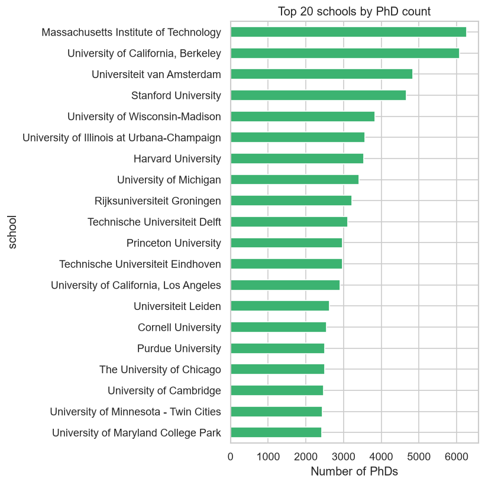

Dominated by large US research universities: MIT (~6,200), UC Berkeley (~6,050),
Stanford (~4,600), followed by Harvard, Michigan, Wisconsin-Madison, Illinois, UCLA
(3,800–4,000). Four Dutch institutions also appear in the top 20 (Amsterdam, Groningen,
Delft, Eindhoven) reflecting the same systematic Dutch record-submission pattern noted
in Section 5 — not that these schools out-produced Oxford or Cambridge. Cambridge is the
only non-US, non-Dutch institution in the top 20.

---

## 7. Subject Areas (MSC Classification)

### 7.1 Top 20 MSC subject codes overall
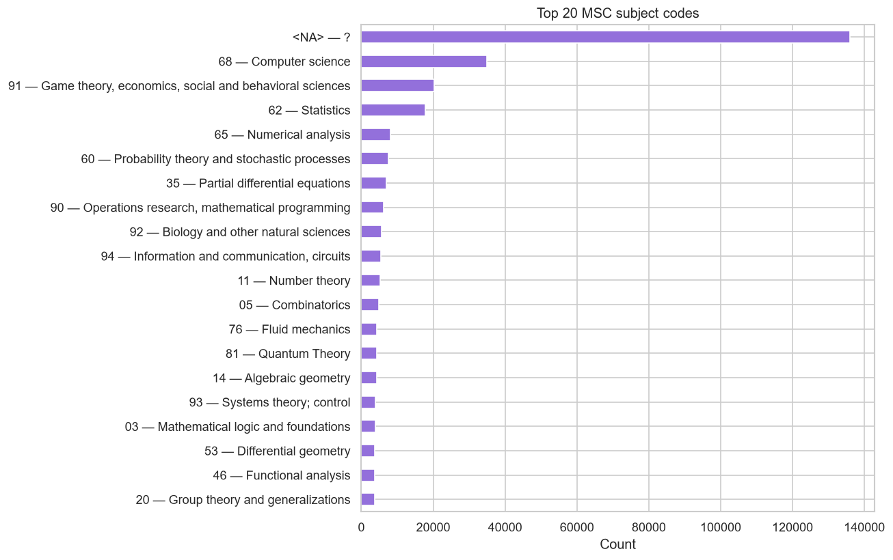

Computer science (68) leads with ~35,000 records, nearly double game theory/economics
(91, ~20,000) and statistics (62, ~18,000). These counts represent the coded subset of
202,492 records (59.8% of the full dataset has a subject code).

### 7.2 Dominant subjects per historical period
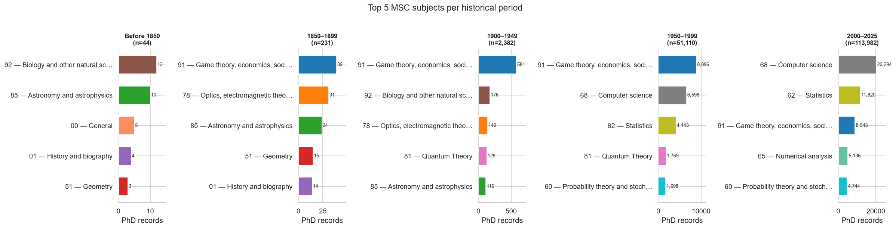

| Period | n | Leading subject |
|---|---|---|
| Before 1850 | 44 | too sparse to interpret |
| 1850–1899 | 231 | Game theory/economics (91) |
| 1900–1949 | 2,382 | Game theory/economics (91) |
| 1950–1999 | 51,110 | Game theory (91), CS (68) entering |
| 2000–2025 | 113,982 | Computer science (68) |

Pure math fields are largely absent before 1950; the landscape modernizes sharply after.

### 7.3 Subject trends over time (1900–2023)
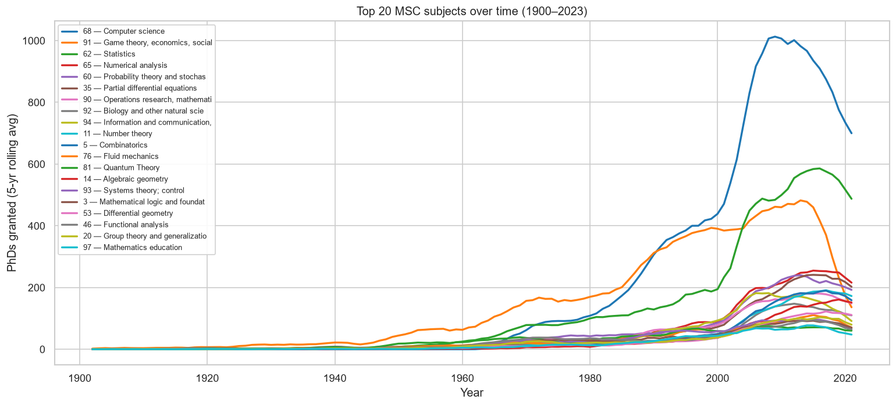

Three phases: **pre-1960** everything under 50/year, led by game theory; **1960–1995**
CS climbs from near zero; **1995–2023** CS surges to ~1,050/year (~2008–2010) before
declining — partly real (CS moving into engineering/interdisciplinary programs), partly
the data-lag effect. The universal drop after 2020 is the same lag artifact.

---

## 8. Subject Specialization by Country

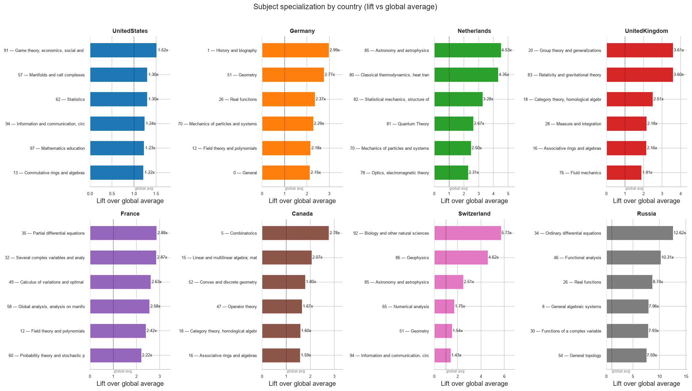

Lift = (subject's share within a country) / (subject's global share). Lift = 1.0 is the
global average; only subjects with ≥30 records/country are included.

| Country | Lift range | Signature |
|---|---|---|
| United States | 1.22x–1.52x | broad, no strong specialization |
| Germany | 2.15x–2.99x | history of math (01), geometry (51), real functions (26) |
| Netherlands | 2.31x–4.53x | astronomy (85), thermodynamics (80), quantum theory (81) |
| United Kingdom | 1.91x–3.61x | group theory (20), relativity (83), category theory (18) |
| France | 2.22x–2.88x | PDE (35), complex variables (32), calculus of variations (49) |
| Canada | 1.59x–2.78x | combinatorics (05), linear algebra (15) |
| Switzerland | 1.43x–5.73x | biology/natural sciences (92), geophysics (86) |
| Russia | 7.59x–12.62x | ODEs (34), functional analysis (46), real functions (26) |

Russia has by far the strongest national signature — the fingerprint of the Soviet
mathematical school's focus on classical hard analysis, topology, and algebra.
Computer science (68) shows no country-level concentration (lift ≈ 1.0 everywhere),
consistent with it being a globally distributed, nationally-rootless field.

---

## 9. Thesis Title Analysis

### 9.1 Global word cloud
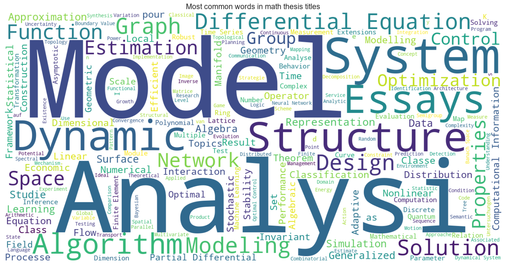

Across 307,399 titled theses: "System", "Dynamic", "Model", "Analysis", "Structure"
dominate — reflecting the applied-math skew of a dataset weighted toward post-1950 PhDs.

### 9.2 Word clouds by top 3 MSC subjects
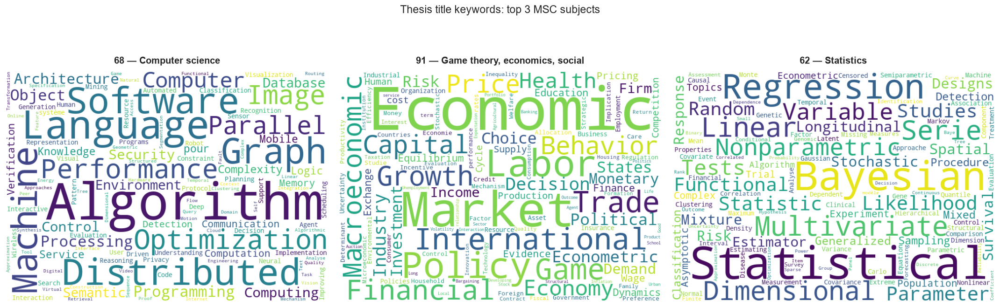

Three filtering iterations were run; this is the final, most aggressively-filtered version.

- **68 — Computer Science**: Algorithm, Software, Language, Machine, Graph, Distributed,
  Optimization, Processing — ML/NLP and systems/networking themes.
- **91 — Game Theory, Economics**: Economic, Market, Labor, Financial, International,
  Policy, Growth, Macroeconomic, Equilibrium, Trade.
- **62 — Statistics**: Regression, Bayesian, Multivariate, Nonparametric, Longitudinal,
  Survival, Likelihood — notable overlap with biostatistics (Clinical, Disease, Gene).

### 9.3 Diagnostics for the yearly subject series
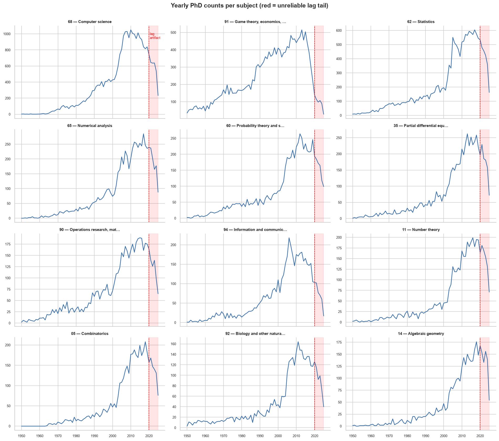

Stationarity/ACF-style diagnostics on the per-subject yearly count series, restricted to
1950–2019 (12 subjects diagnosed) to set up the trend analysis in the next section.

### 9.4 Thesis title keywords: top 10 MSC subjects
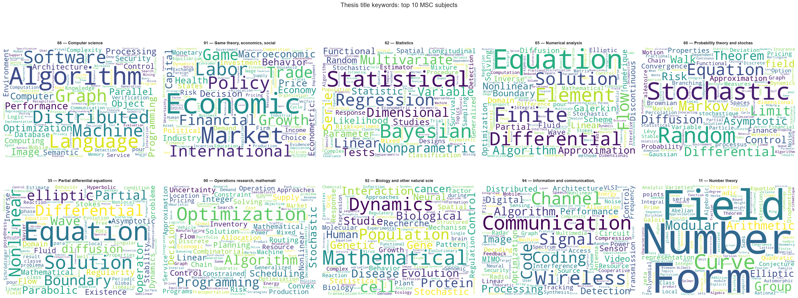

Confirms field-specific vocabulary holds beyond the top 3: numerical analysis (65) →
"Numerical, Equation, Finite"; probability (60) → "Stochastic, Markov, Brownian"; PDE
(35) → "Elliptic, Nonlinear, Boundary"; operations research (90) → "Optimization,
Scheduling, Routing"; biology (92) → "Cell, Protein, Cancer, Genetic" (the most
domain-specific panel); info/communication (94) → "Signal, Channel, Wireless"; number
theory (11) → "Arithmetic, Modular, Diophantine, Galois". Even simple bag-of-words
title text carries strong signal for MSC classification.

---

## Rising Vocabulary in Thesis Titles Over Time

The idea: new terminology often appears in titles **before** a subject grows large, so
words with the biggest late/early frequency ratio are candidate leading indicators.

### Rising words (raw ratio)
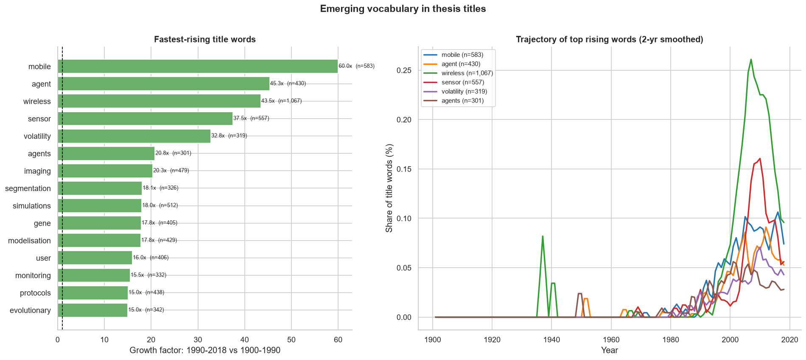

Top risers by late/early growth ratio include *mobile* (60x), *agent* (45x), *wireless*
(43x), *sensor* (37x), *volatility* (33x).

### Linking rising words to subjects
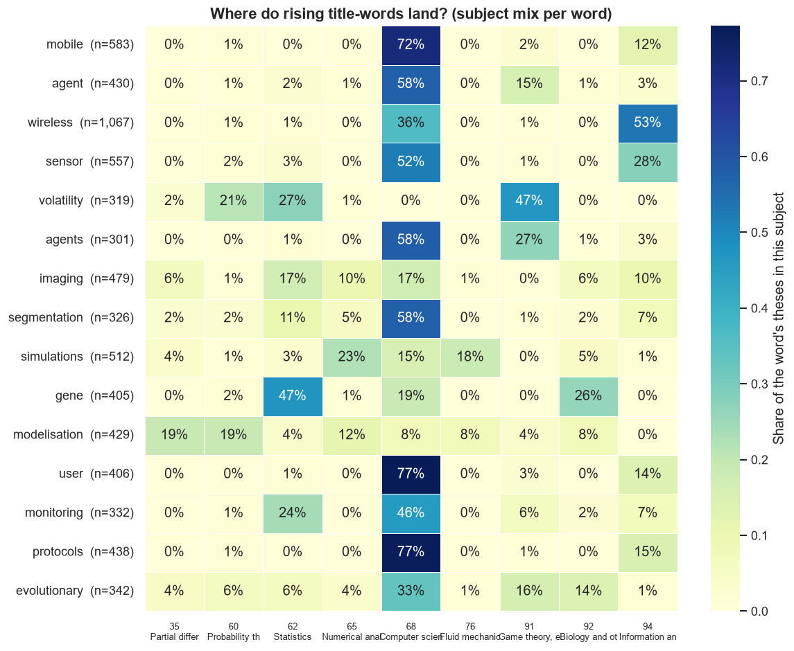

Checks which MSC subject each rising word's theses belong to. Words like *user*,
*protocols*, *mobile*, *agent(s)* concentrate strongly (58–77% share) in Computer
Science (68).

### True emergence (small historical base + currently rising)
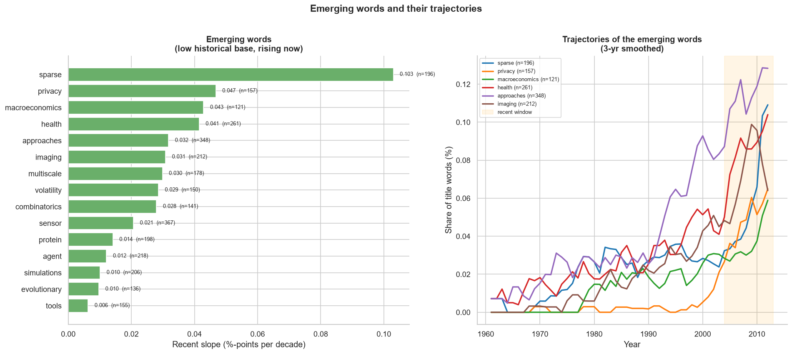

Filters to words that were rare historically *and* are rising now (not just generically
common words getting a small boost). Top emerging terms: *sparse*, *privacy*,
*macroeconomics*, *health*, *imaging*, *multiscale*.

### Emergence filtered by subject concentration
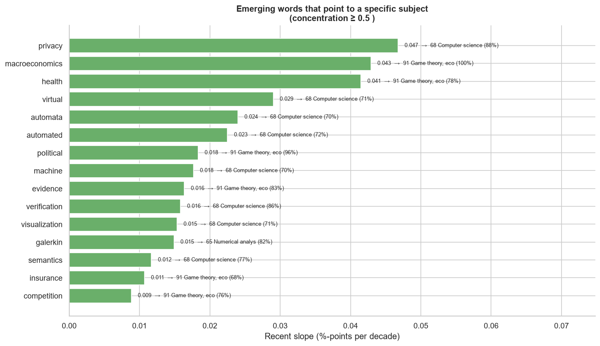

Further restricts to words that concentrate in one subject (high Herfindahl) rather than
scattering across many — a self-maintaining filter for generic vs. real topic words.
E.g. *privacy* (88% CS), *macroeconomics* (99.5% game theory/econ), *virtual* and
*automata* (70%+ CS).

---

## Subject Inheritance and Leaving Through the Advisor–Student Genealogy

Tests whether students tend to share their advisor's subject — i.e., whether subject
propagates structurally through the genealogy tree.

### Subject inheritance rate
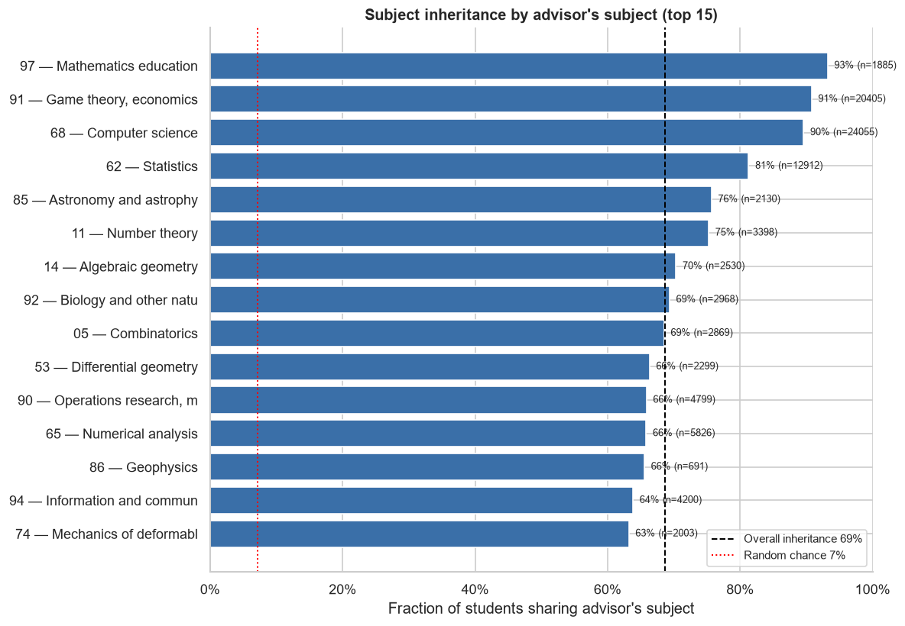

- Edges with both subjects known: **154,365**
- Subject inheritance rate: **68.7%**
- Random-chance baseline: **7.2%**
- **Lift over chance: 9.6x**

### Which subjects do students leave?
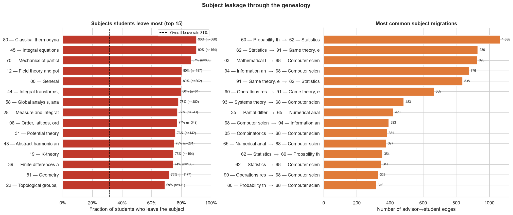

Highest leave-rate subjects (advisor's field abandoned most often by students, n≥50):
classical thermodynamics (80, 90.3%), integral equations (45, 90.2%), mechanics of
particles (70, 86.5%), field theory (12, 80.2%), general (00, 80.1%).

### Subject persistence by generation
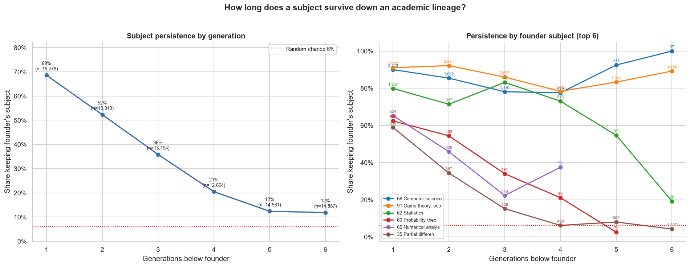

Tracks descendants of ~4,000 sampled "founders" generation by generation:

| Generation | Persistence | n |
|---|---|---|
| 1 | 68.6% | 15,278 |
| 2 | 52.3% | 13,913 |
| 3 | 35.9% | 13,154 |
| 4 | 20.5% | 12,664 |
| 5 | 12.4% | 14,581 |
| 6 | 11.9% | 14,887 |

Random-chance baseline: 6.0%. Subject identity decays steadily down a lineage but stays
well above chance even six generations out — a subject is "sticky" but not permanent.

---

## Files

All figure PNGs referenced above are in `images/` at the same resolution the notebook saved them.
