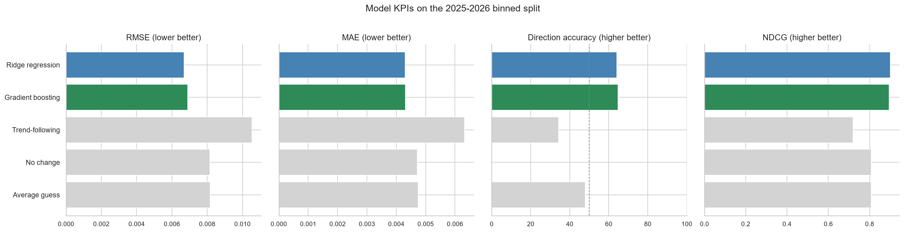
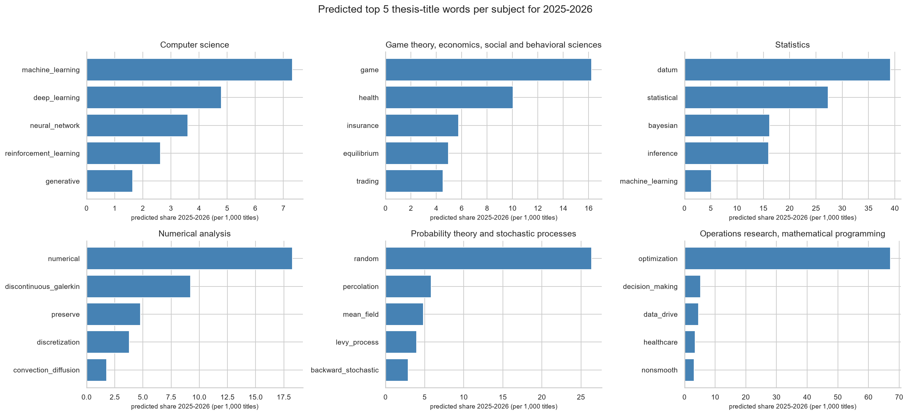
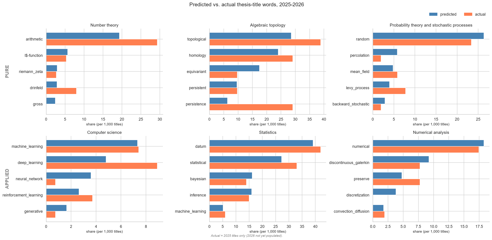

# Keyword Trends

## Question

Within each subject, which thesis-title keywords are rising over time, and can we
predict which will keep trending?

## Idea

New terminology tends to show up in thesis titles before a topic grows large. By
tracking each word's usage share within a subject, we flag words with a low
historical base and a steep recent rise, then train a model to predict which of
those keep climbing.

## Two-year binning

Recent years are affected by data-entry lag: title volume in the newest calendar
years is only partially populated (e.g. 2024 sits well below 2022-2023, and 2025
is roughly half a normal year). Working in single calendar years makes the most
recent points noisy and the very latest year nearly empty.

To smooth this, the pipeline works in **consecutive 2-year bins** instead of
single years. Bins are anchored at the most recent year, so the newest bin is
`2025-2026`, the one before it `2023-2024`, and so on back through the data. All
shares, trends, lags, and the prediction target are computed on this bin axis.
The forecast target is the next bin (`2025-2026`) rather than a single year.

Binning trades time resolution for stability: each data point rests on twice the
title volume, so subject-year shares are less noisy and the final usable bin is
fuller. The cost is a coarser view of time and a smoother prediction target, so
error metrics here are not directly comparable to a single-year setup.

## Folder Structure

```
keyword_trends-Aaroodd/
├── README.md
├── kpis.md
├── 02_keyword_trends_eda.ipynb
├── 02_build_parquets.ipynb
├── 03_model_final.ipynb
├── images/                          # figures used in README
├── archive/
│   ├── models.ipynb                 # previous models, kept for reference
│   └── fasttextvlangdetect.ipynb    # not needed, kept for reference
├── lid.176.bin                      # not in the Github repo, please download from  https://dl.fbaipublicfiles.com/fasttext/supervised-models/lid.176.bin
└── data/
    ├── parquet files and csv files from .ipynb runs
```

## Data

Starting from 338,532 rows in the full dataset, we narrow to a usable set in
four steps:

- **Subject code origin:** keep only rows with an original (from the MGP website)
  subject code, not a model-predicted one. This drops 77,711 predicted-code rows,
  leaving 202,492 rows (59.8% of the total).
- **Completeness:** keep only rows with a title and year present, leaving
  160,548 rows across 63 subjects.
- **Language:** titles are filtered to English using fastText lid.176, keeping
  144,594 of 160,548 titles (90.1%). fastText was chosen over langdetect after
  manual inspection showed langdetect misread short English titles.
- **Bin window:** after 2-year binning, the usable window is derived from volume,
  not fixed by hand. A bin is kept once its total title-word volume clears a floor
  (`MIN_VOLUME_PER_BIN = 1000`); the first bin above the floor is `1949-1950`.
  The last complete bin is `2023-2024`; the partial `2025-2026` bin is held out of
  training and used only as the forward-forecast target. Subject-bins with fewer
  than 50 total title words are excluded on top of this.

## Method

**Tokenizer** (shared with `01_build_parquets.ipynb`):
- Strip accents via `unicodedata.normalize("NFD")` before tokenizing
- spaCy `en_core_web_sm` with parser and NER disabled (tagger only)
- Keep NOUN, ADJ, VERB, PROPN; drop spaCy stopwords; min lemma length 4
- Drop a custom list of generic academic filler words (e.g. study, method,
  model, research, theory, application, case) that pass spaCy's stopword filter
  but carry no topical signal in thesis titles
- Bigram detection via gensim Phrases (trained once in build_parquets, applied
  here) to capture phrases like `machine_learning`, `neural_network`

**Rising-word detection** (all on the 2-year bin axis):
- Per-subject word share = word token count / total title tokens per bin
- Specificity filter: subject share / global share >= 1.5 (removes generic terms)
- Rising score: linear slope over a recent 5-bin window (10 years)
- Enriched score: rising score weighted by specificity and penalized by global
  frequency, so words that are both generic and non-specific rank low. Only
  meaningful for ranking words within the same subject, not across subjects.
- Deduplication: merges lemma/bigram variants of the same word (e.g.
  learn/learning, machine_learn/machine_learning) using underscore-aware
  token-prefix matching on stemmed tokens.

The same detection runs across all subjects with enough data.

## Modeling (`03_model_final.ipynb`)

Predicts the next-bin change in a word's share of thesis titles within a subject,
for words already flagged as rising by the EDA method.

**Target:** `dshare = share(t+1) - share(t)` on the bin axis, i.e. the change in a
word's share from one 2-year bin to the next. Modeling the change instead of the
raw share means metrics measure real predictive skill, not just rewarding the
model for copying the previous value.

**Features** (all leak-free, using data from bins <= t only; window labels are
legacy names and now count bins, so "5yr" means a 5-bin window = 10 years):
- `share_lag1`, `share_lag2`, `share_lag3`: word share in each of the last 3 bins
- `slope_3yr`, `slope_5yr`: linear share trend over the last 3 and 5 bins
- `accel`: `slope_3yr - slope_5yr` (short-term vs long-term trend gap)
- `vol_5yr`: rolling std of share over 5 bins
- `spec_cum`: cumulative subject-specificity ratio
- `word_age`: bins since the word first appeared in the subject
- `log_volume`: log of that subject-bin's total title-word volume

**Leak-free design:**
- Rising-word candidates selected using only data up to `SELECT_END`, never from
  the test window. A selection-leak probe reports how many candidates would change
  if future data had been allowed.
- Panel is zero-filled: a bin where a word doesn't appear counts as share = 0,
  not a skipped row.
- Sample weights = next-bin title-word volume, so noisy small-subject-bins count
  less.

**Split:** train on bins up to `SELECT_END` (`2013-2014`), test on the following
bins. Because the target needs a next bin, the last complete bin (`2023-2024`)
serves as the answer key for the final test point and as the feature input for
the forward forecast, but is not itself a scored training row (its own next bin,
`2025-2026`, is the partial forecast target). A multi-window robustness pass
re-runs the full leak-free pipeline at several earlier cutoffs to confirm the
result is not a fluke of one split.

**Leakage checks (final split):**
- Shuffled-target RMSE = 0.008176, at or above the zero-change RMSE (0.008158),
  so features do not predict a randomized target.
- Clean vs full-window candidate overlap = 112/460 (24%): the words selected with
  data through `2013-2014` differ substantially from those a future-peeking setup
  would pick, which is the gap a naive setup would have quietly exploited.

**Models compared** (identical leak-free panel and test window):

| Model | Type | Description |
|---|---|---|
| Dummy (mean) | Trivial | Predicts the training-set mean `dshare` for every row |
| Zero-change | Trivial (domain) | Predicts `dshare = 0` (persistence) |
| Momentum (slope_3yr) | Domain baseline | Predicts `dshare = slope_3yr` |
| Ridge (weighted) | Linear | Standardized features, sample-weighted |
| HistGBR (weighted) | Tree-based | Histogram gradient boosting |

KPI definitions and improvement directions are in `kpis.md`.

## Results

Metrics on the held-out test bins (change target, `dshare`). Ridge is the primary
model; the trivial and domain baselines confirm the features are worth it.
Full table saved to `data/kpi_summary_v5_final.csv`.

| Model | RMSE | MAE | Direction acc | NDCG |
|---|---|---|---|---|
| Dummy (mean) | 0.008161 | 0.004741 | 48.0% | 0.808 |
| Zero-change | 0.008158 | 0.004718 | 0.0% | 0.808 |
| Momentum (slope_3yr) | 0.010534 | 0.006330 | 34.3% | 0.719 |
| **Ridge (weighted)** | **0.006698** | **0.004298** | **64.1%** | **0.900** |
| HistGBR (weighted) | 0.006894 | 0.004316 | 64.8% | 0.894 |

**Key findings:**
- Both models beat every baseline on RMSE, MAE, and NDCG. Ridge and HistGBR are
  effectively tied: Ridge has the lowest RMSE/MAE and highest NDCG, HistGBR edges
  direction accuracy (64.8% vs 64.1%). The relationship is close to linear once
  share-lag features are included, so the tree model finds little extra structure.
  Ridge is kept as the primary model for its simplicity and interpretable
  coefficients.
- Ridge cuts RMSE by about 18% versus the trivial baselines (0.0067 vs 0.0082)
  and roughly doubles direction accuracy over a coin flip.
- Momentum (`slope_3yr` alone) is worse than trivial: higher RMSE than
  zero-change and direction accuracy below 50% (34.3%). In this data, recent
  rises tend to revert rather than continue, so naive trend-following loses. The
  Ridge coefficients reflect this: a positive lag-1 with a negative lag-2 and
  negative slopes encode mean reversion.
- Zero-change scores 0% direction accuracy by construction (it never picks a
  nonzero sign), not by failure. Its RMSE is the real bar, and both models clear
  it. Dummy and Zero-change tie on RMSE/MAE/NDCG because both predict a value very
  near zero on this near-zero-mean target.
- Both models rank words far better than momentum (NDCG 0.900 / 0.894 vs 0.719):
  their top-ranked words are the ones that actually moved.


*RMSE, MAE, direction accuracy, and NDCG on the binned test split. Ridge and
HistGBR are colored; the three baselines are gray. Lower is better for RMSE and
MAE, higher for direction accuracy and NDCG.*


*Left: residual vs predicted, no strong slope. Middle: mean residual by test bin,
slightly negative and stable (a small, uniform over-prediction, ~1.5 per 1,000
titles) with no drift. Right: residual distribution is symmetric with light tails.*

## Watchlist and forward check

The trained model is applied one bin past the last complete bin to produce a
per-subject watchlist for `2025-2026`. This is the only place full data is used on
the selection side, since we are making a forward prediction rather than
evaluating. The watchlist is ranked by predicted share, so it reads as "the words
expected to be most prominent," and is saved to
`data/watchlist_2025-2026_v5_final.csv`.


*Predicted top thesis-title words for 2025-2026 in the highest-volume subjects,
ranked by predicted share.*

Because the `2025-2026` bin already has partial data (essentially all of 2025;
2026 is not yet populated), we can sanity-check the forecast against what has
actually shown up so far. Restricting both sides to the same candidate words, the
predicted and actual shares track closely in the best-covered subjects.



*Predicted (blue) vs. actual (coral) share for each subject's predicted words in
2025-2026, three pure fields (top row) and three applied (bottom). Because 2026
titles are not yet populated, "actual" reflects 2025 only, making this a
directional sanity check rather than full validation. The fit is close in the
best-covered subjects: Statistics and Probability theory match the predicted
ranking almost exactly (rank correlation 0.99 and 0.95), with every predicted
word appearing in the real data. Some smaller fields show predicted words not yet present in the partial 2025 data.*
 
This forward check supports the backtest rather than replacing it. The
performance claim rests on the held-out bins, where the model calls the direction
of change correctly 64% of the time (versus 35% for trend-following) and ranks
the movers with 0.900 NDCG. The 2025-2026 comparison simply shows what that skill
looks like on the freshest titles available.