# Keyword Trends

## Question

Within each subject, which thesis-title keywords are rising over time, and can we
predict which will keep trending?

## Idea

New terminology tends to show up in thesis titles before a topic grows large. By
tracking each word's yearly usage share within a subject, we want to flag words
with a low historical base and a steep recent rise.
## Folder Structure

```
keyword_trends-Aaroodd/
├── README.md
├── 01_build_parquets.ipynb
├── 02_keyword_trends_eda.ipynb
├── 03_model_v2.ipynb
├── images/                     # figures used in README
├── archive/
│   ├── models.ipynb          # previous models, kept for reference
│   └── fasttextvlangdetect.ipynb  # not needed, kept for reference
├── lid.176.bin
└── data/
    ├── global_counts.parquet
    ├── bigram_model.pkl
    ├── subject_counts/
    ├── word_year_subject.parquet
    ├── subject_meta.parquet
    └── watchlist_2024.csv
```
## Data

Starting from 338,532 rows in the full dataset, we narrow to a usable set in
four steps:

- **Subject code origin:** keep only rows with an original (from the MGP website)
  subject code, not a model-predicted one (by Osanda). This drops 77,711 predicted-code
  rows, leaving 202,492 rows (59.8% of the total).
- **Completeness:** keep only rows with a title and year present, leaving
  160,548 rows across 63 subjects.
- **Language:** titles are filtered to English using fastText lid.176, keeping
  144,594 of 160,548 titles (90.1%). fastText was chosen over langdetect after
  manual inspection showed langdetect misread short English titles.
- **Year window:** derived dynamically, not fixed. START_YEAR is the first year
  with at least 200 titles (a stable-share floor). TREND_END is the last year
  before title volume drops below 75% of the peak, which catches data-entry
  lag in recent years. Subject-years with fewer than 50 total title words are
  excluded on top of this (see Method section for the derived window and plot).


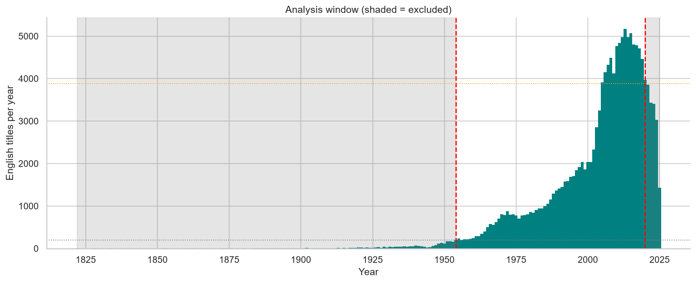
*Title volume by year, shaded regions excluded. START_YEAR and TREND_END are
derived from volume thresholds, not fixed by hand.*


## Method

**Tokenizer** (`01_keyword_trends_eda.ipynb`, shared with `02_build_parquets.ipynb`):
- Strip accents via `unicodedata.normalize("NFD")` before tokenizing
- spaCy `en_core_web_sm` with parser and NER disabled (tagger only)
- Keep NOUN, ADJ, VERB, PROPN; drop spaCy stopwords; min lemma length 4
- Drop a custom list of generic academic filler words (e.g. study, method,
  model, research, theory, application, case) that pass spaCy's stopword
  filter but carry no topical signal in thesis titles
- Bigram detection via gensim Phrases (trained once in build_parquets, applied
  here) to capture phrases like `machine_learning`, `neural_network`

**Subject volume check:** each subject's title volume is checked per decade
before trusting its word shares. Subjects with thin decades are treated with
caution in the rising-word ranking.

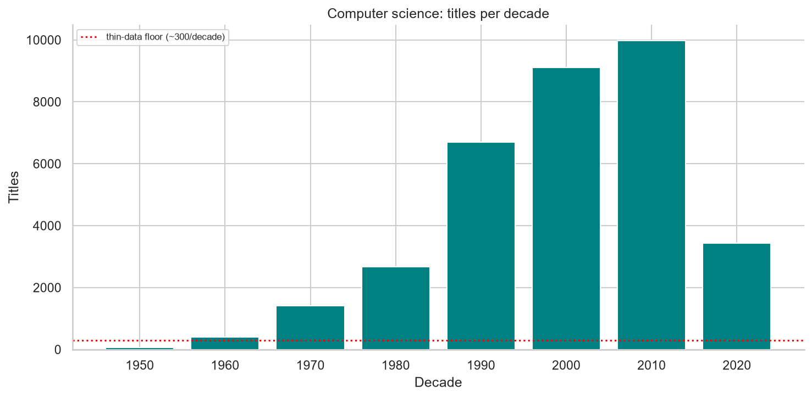
*Computer science, titles per decade against a thin-data floor.*

**Rising-word detection:**
- Per-subject word share = word token count / total title tokens per year
- Specificity filter: subject share / global share >= 1.5 (removes generic terms)
- Rising score: linear slope over a recent 10-year window
- Enriched score: rising score weighted by specificity and penalized by
  global frequency, so words that are both generic and non-specific rank low.
  Not a bounded or normalized metric, only meaningful for ranking words
  within the same subject, not for comparing magnitudes across subjects.
- Deduplication: merges lemma/bigram variants of the same word (e.g.
  learn/learning, machine_learn/machine_learning) using underscore-aware
  token-prefix matching

The plots below use Computer science as a worked example, one of the
highest-volume subjects. The same method runs across all subjects.

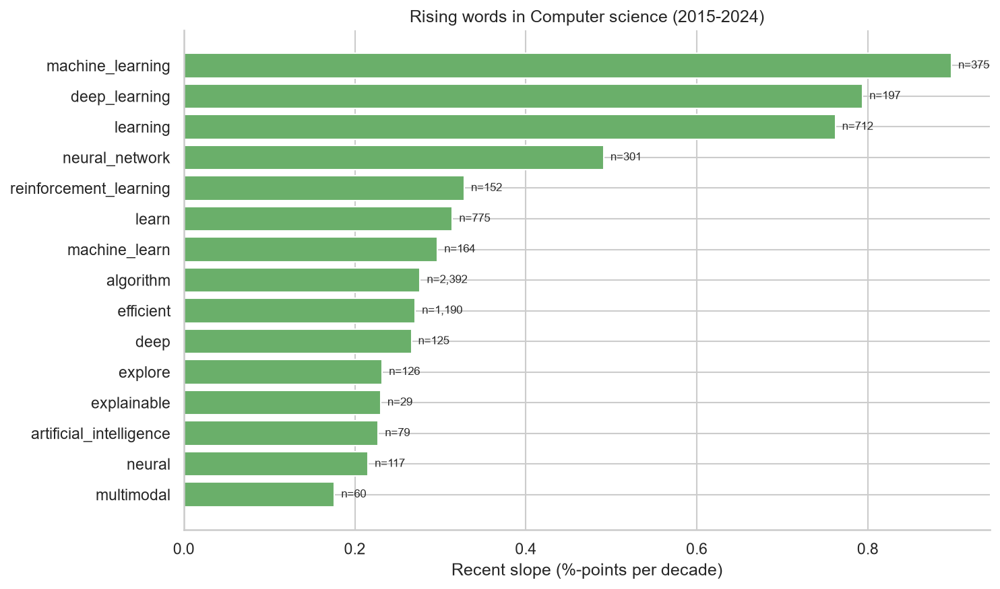
*Top rising words in Computer science, ranked by recent slope.*

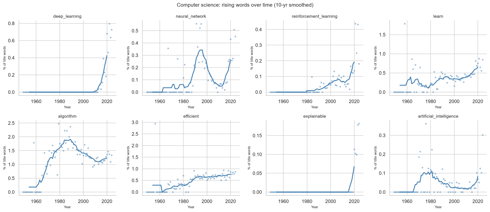
*Yearly share (10-yr smoothed) for Computer science's top rising words.
Deep_learning, reinforcement_learning, and explainable show clear post-2015
inflections; algorithm peaks in the 1980s-90s and gradually declines as a
share of titles, showing the method also catches fading terms, not just
rising ones.*


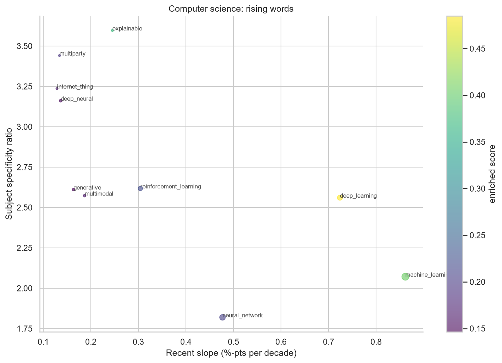
*Recent slope vs subject-specificity for Computer science's rising words,
bubble size is total word count, color is enriched score. deep_learning has
both a high slope and high enriched score; explainable is more specific
(higher specificity ratio) but lower volume.*

**Multi-subject scan:** the same detection runs across all subjects with
enough data, using precomputed per-subject counts from build_parquets.

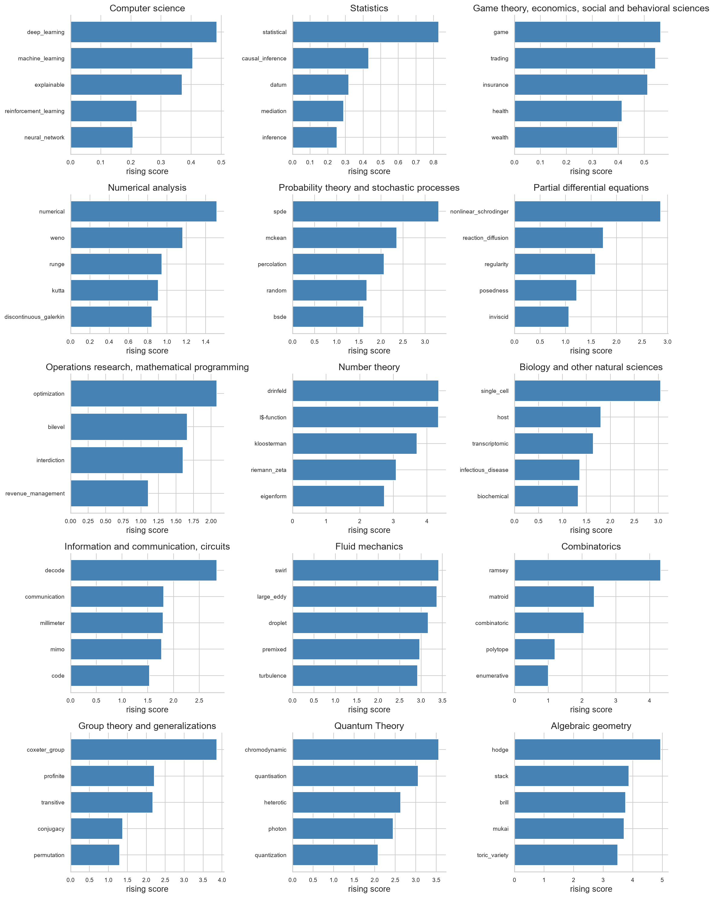
*Top 5 rising words in the 15 subjects with the most titles, ranked by
enriched score. Not directly comparable across subjects with very different
total title counts.*
## Pipeline outputs

`01_build_parquets.ipynb` runs once and produces everything the EDA and
modeling notebooks need. Outputs are versioned (`_v5_final` suffix) so
changing the tokenizer, filters, or dataset never silently reuses stale
cached files:

- `data/global_counts_v5_final.parquet` — global lemma counts across all
  titles. 27,804 unique lemmas.
- `data/bigram_model_v5_final.pkl` — trained gensim Phraser. 447 bigrams
  learned (e.g. `differential_equation`, `machine_learning`,
  `neural_network`, `monte_carlo`).
- `data/subject_counts/XX_v5_final.pkl` — per-subject (year_word, year_total)
  cache, one file per subject, 63 subjects total.
- `data/word_year_subject_v5_final.parquet` — flat modeling table
  (word x subject x year). 445,666 rows, 27,804 unique words, 63 subjects.
- `data/subject_meta_v5_final.parquet` — subject code to name + title count
  lookup. Largest subjects by title count: Computer science (23,692),
  Game theory/economics/social sciences (17,700), Statistics (14,502).

**Filtering applied before tokenizing:**
- Only original (human-assigned) subject codes are kept, not model-predicted ones
- A custom academic-stopword list is dropped in addition to spaCy's default
  stopwords (e.g. study, method, model, research, theory, application, case),
  since these pass spaCy's filter but carry no topical signal in thesis titles
- Tokens: NOUN, ADJ, VERB, or PROPN (proper nouns only kept when they end up
  inside a bigram), min lemma length 4

**Sanity checks run on the saved output:**
- Words expected to survive filtering (e.g. `network`, `stochastic`, `markov`)
  are confirmed present with nonzero counts
- Top bigrams by total count: `differential_equation` (1,002),
  `time_series` (758), `high_dimensional` (751), `machine_learning` (602),
  `neural_network` (447)
## Modeling (`03_model_final.ipynb`)

Predicts next-year change in a word's share of thesis titles within a
subject, for words already flagged as rising by the EDA method.

**Target:** `dshare = share(t+1) - share(t)`. Modeling the change instead
of the raw share means metrics measure real predictive skill, not just
rewarding the model for copying last year's number.

**Features** (all computed leak-free, using data from years <= t only):
- `share_lag1`, `share_lag2`, `share_lag3`: word share in each of the last
  three years
- `slope_3yr`, `slope_5yr`: linear share trend over the last 3 and 5 years
- `accel`: `slope_3yr - slope_5yr` (short-term vs long-term trend gap)
- `vol_5yr`: rolling std of share over 5 years
- `spec_cum`: cumulative subject-specificity ratio
- `word_age`: years since the word first appeared in the subject
- `log_volume`: log of that subject-year's total title-word volume

**Leak-free design:**
- Rising-word candidates selected using only data up to `SELECT_END`, never
  from the test window. Confirmed by a selection-leak probe that shows how
  many candidates would have changed if future data had been allowed.
- Panel is zero-filled: a year where a word doesn't appear counts as
  share = 0, not a skipped row.
- Sample weights = next-year title-word volume, so noisy small-subject-years
  count less.

**Evaluation:** expanding-window time-series cross-validation across four
folds. Selection and feature panel are rebuilt inside each fold so nothing
downstream ever touches its own test window. Two additional leakage checks
are run on the final fold:
- Shuffled-target RMSE must be at or above the zero-change RMSE (features
  should not predict a randomized target).
- Overlap between clean and full-window candidate selection is reported, to
  quantify how much a naive setup would have quietly leaked.

**Models compared** (all evaluated on the identical CV folds):

| Model | Type | Description |
|---|---|---|
| `Dummy (mean)` | Trivial | `DummyRegressor(strategy="mean")` |
| `Zero-change` | Trivial (domain) | Predicts `dshare = 0` (persistence) |
| `Momentum (slope_3yr)` | Domain baseline | Predicts `dshare = slope_3yr` |
| `Ridge (weighted)` | Linear | Standardized features, sample-weighted |
| `HistGBR (weighted)` | Tree-based | Histogram gradient boosting |

KPI definitions and improvement directions are in `kpis.md`.

## Results

CV means and standard deviations across four expanding-window folds
(train up to split_year, test the next 10 years). Ridge is the primary
model; trivial baselines (Dummy, Zero-change) and the domain baseline
(Momentum) confirm the model is worth the extra features.

| Model | RMSE | MAE | Direction acc | NDCG |
|---|---|---|---|---|
| Dummy (mean) | 0.0099 ± 0.0008 | 0.0057 ± 0.0005 | 49.3% ± 0.6% | 0.810 ± 0.003 |
| Zero-change | 0.0099 ± 0.0008 | 0.0057 ± 0.0005 | 0.0% ± 0.0% | 0.810 ± 0.003 |
| Momentum (slope_3yr) | 0.0132 ± 0.0010 | 0.0078 ± 0.0006 | 32.9% ± 0.9% | 0.724 ± 0.002 |
| **Ridge (weighted)** | **0.0078 ± 0.0007** | **0.0049 ± 0.0004** | **69.8% ± 0.6%** | **0.913 ± 0.006** |
| HistGBR (weighted) | 0.0082 ± 0.0007 | 0.0050 ± 0.0004 | 69.7% ± 0.3% | 0.899 ± 0.009 |

Full table saved to `data/kpi_summary_v5_final.csv`.

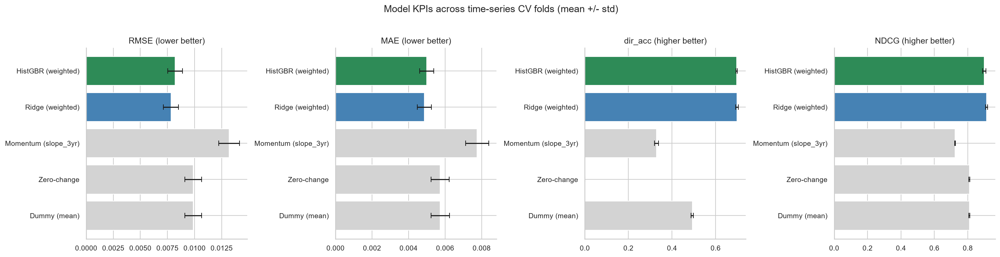
*Model KPIs across four time-series CV folds (mean +/- std). Ridge and
HistGBR are colored; the three baselines are gray. Lower is better for
RMSE and MAE, higher for direction accuracy and NDCG.*

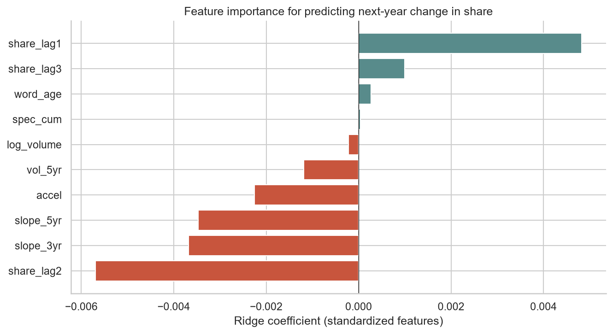
*Ridge coefficients on standardized features, final CV fold. Lag features
dominate the signal; specificity and volume features add little to
share-level prediction (but specificity is essential for the upstream
candidate filter).*

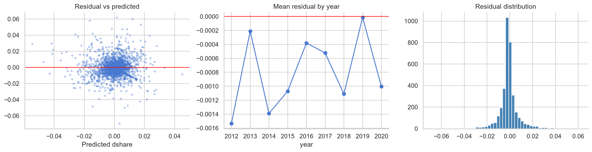
*Left: residual vs predicted, no obvious slope. Middle: mean residual by
test year, close to zero across the test window, no drift. Right: residual
distribution is symmetric with light tails.*

**Key findings:**
- Ridge beats HistGBR by a small margin on all four KPIs. The
  relationship is approximately linear once share-lag features are
  included; the tree-based model does not find useful nonlinear structure
  here.
- Ridge cuts RMSE by about 21% vs the trivial baselines (0.0078 vs 0.0099)
  and lifts direction accuracy from ~50% to ~70%.
- Momentum (`slope_3yr` alone) is worse than trivial: it has higher RMSE
  and gets the direction wrong more often than right (32.9%). Recent slope
  is a useful ingredient inside the model, but on its own it over-reacts
  to noise.
- Zero-change scores 0% direction accuracy by construction (it never picks
  a nonzero sign), not by failure. Dummy and Zero-change tie on RMSE/MAE/NDCG
  because they both predict a value very near zero on this near-zero-mean
  target.
- Lag features carry most of the predictive signal; recent slope adds a
  small increment. Specificity does not predict share level, but is what
  makes upstream candidate selection work.

## Watchlist

The trained model is applied one step past `TREND_END` to produce a
per-subject watchlist of words most likely to keep rising. This is the only
place full data is allowed on the selection side, since we are making a
forward prediction here rather than evaluating.

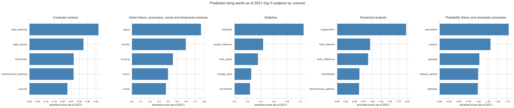
*Predicted top rising words as of 2024 (TREND_END) in the five highest-volume
subjects, ranked by enriched score from the EDA method applied to the full
data window (selection uses all data up to TREND_END, since this is a
forward prediction, not evaluation). The full watchlist with the model's
predicted change-in-share is saved to `data/watchlist_2022_v5_final.csv`.*

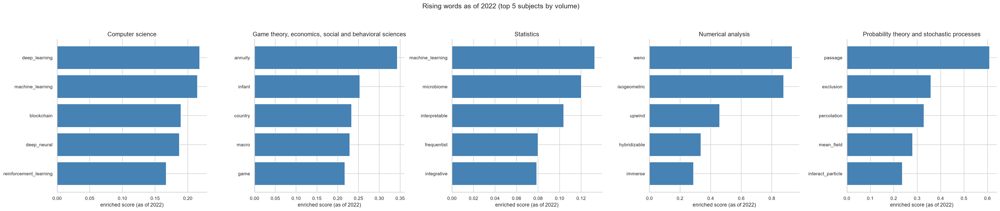
*Actual top rising words as of 2022 in the same five subjects, using the
same enriched score for direct comparison. Words present in both plots
(e.g. `deep_learning`, `machine_learning` in Computer science) have
sustained rising signal across two years; words new to the 2024 plot are
newly emerging candidates.*
